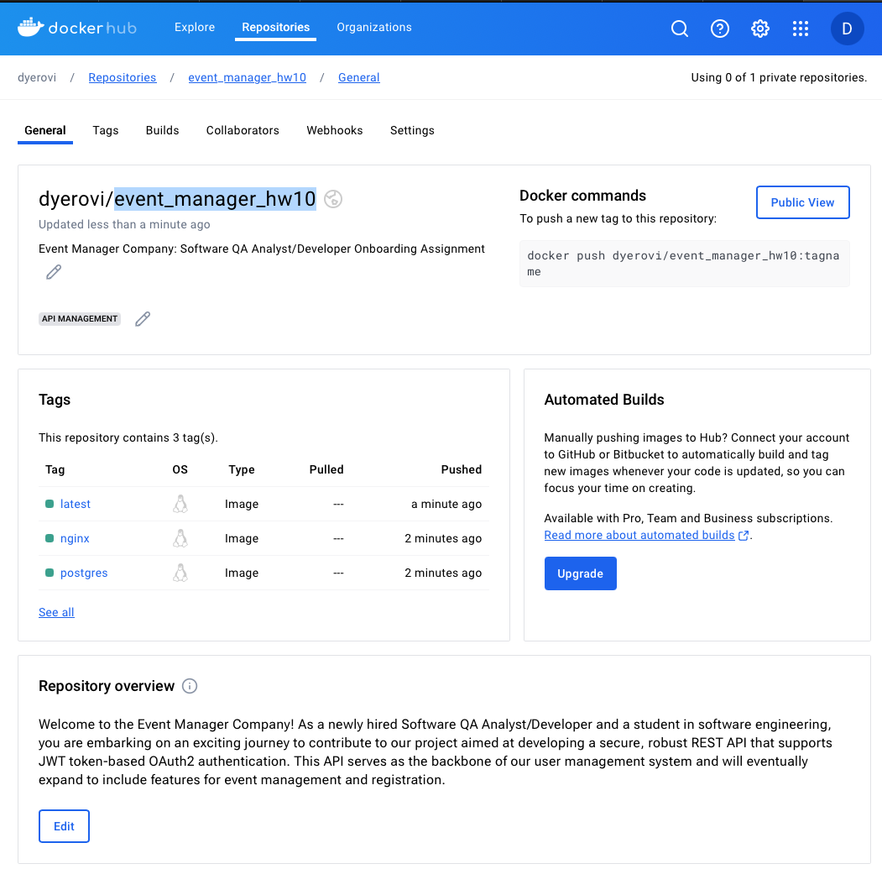
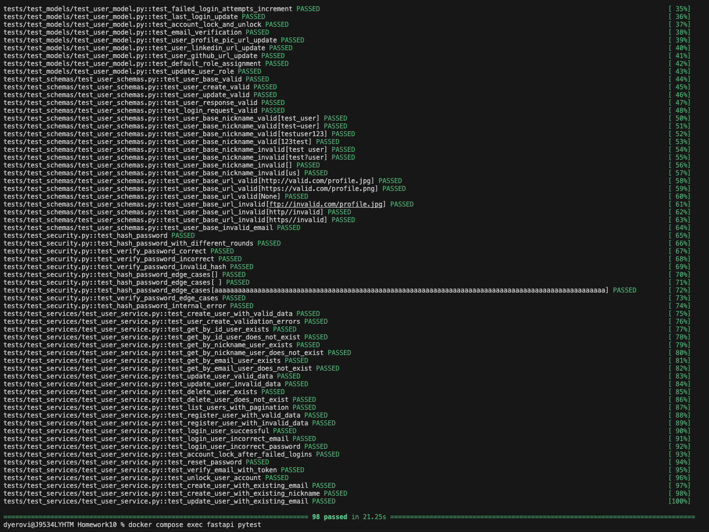

# Event Manager Company: Software QA Analyst/Developer Onboarding Assignment

## Submission Requirements

To complete this assignment, submit the following:

1. **GitHub Repository Link**: Ensure that your repository is well-organized and includes:
  - Links to five closed issues, each with accompanying test code and necessary application code modifications.
  - Each issue should be well-documented, explaining the problem, the steps taken to resolve it, and the outcome. Proper documentation helps others understand your work and facilitates future maintenance.
  - All issues should be merged into the main branch, following the Git workflow and best practices.

2. **Updated README**: Replace the existing README with:
  - Links to the closed issues, providing easy access to your work.
  - Link to project image deployed to Dockerhub.
  - A 2-3 paragraph reflection on what you learned from this assignment, focusing on both technical skills and collaborative processes. Reflect on the challenges you faced, the solutions you implemented, and the insights you gained. This reflection helps solidify your learning and provides valuable feedback for improving the assignment in the future.

## Grading Rubric

| Criteria                                                                                                                | Points |
|-------------------------------------------------------------------------------------------------------------------------|--------|
| Resolved 5 issues related to username validation, password validation, and profile field edge cases                      | 30     |
| Resolved the issue demonstrated in the instructor video                                                                 | 20     |
| Increased test coverage to 90% by writing comprehensive test cases                                                      | 20     |
| Followed collaborative development practices using Git and GitHub (branching, pull requests, code reviews)              | 15     |
| Submitted a well-organized GitHub repository with clear documentation, links to closed issues, and a reflective summary | 15     |
| **Total**                                                                                                               | **100**|

## Resolved issues

1. user_schemas.py
2. user_service.py
3. user_model.py
4. user_routes.py
5. dependencies.py

## Links to Issues
https://github.com/d-yerovi/event_manager_hw10/pulls?q=is%3Apr+is%3Aclosed

## Image in Dockerhub
https://hub.docker.com/repository/docker/dyerovi/event_manager_hw10/general

## Image of pytest

## Reflective summary

This project taught me about the functioning of APIs and their layered architecture, including service, schema, and model layers. Understanding these layers was crucial for solving issues, such as implementing username validation and uniqueness. These changes involved updates across all layers: schema for validation, service for duplicate checks, and model for database constraints. This multi-layer approach ensured a more robust API.

Additionally, I focused on increasing test coverage and setting up a GitHub Actions workflow. Expanding test coverage to 90% was challenging due to existing tests and required trial and error. Configuring GitHub Actions for DockerHub publishing also posed difficulties, especially with SMTP credentials, which required research. After all , the project was engaging and educational, providing valuable insights into API development and CI/CD processes.
